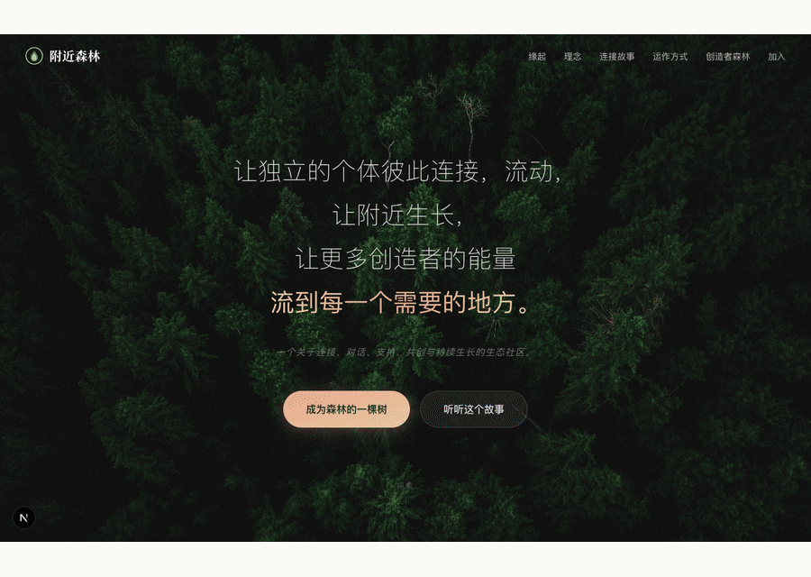
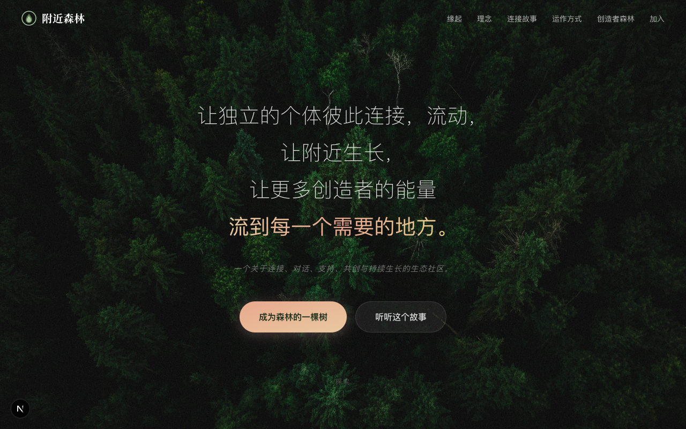
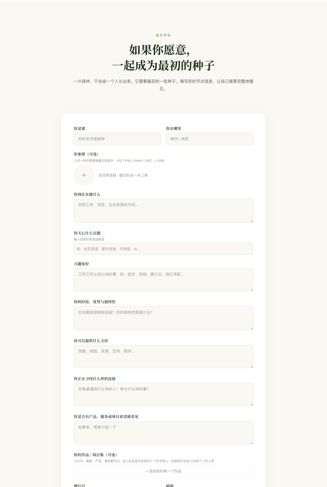
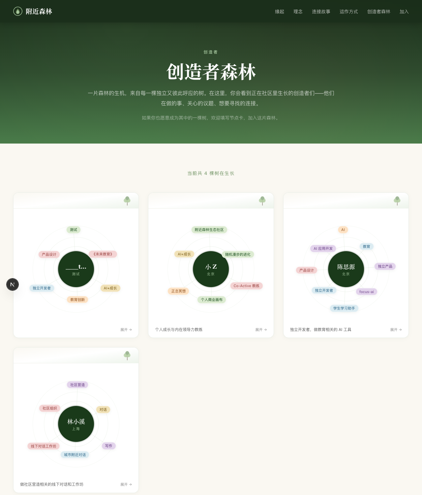
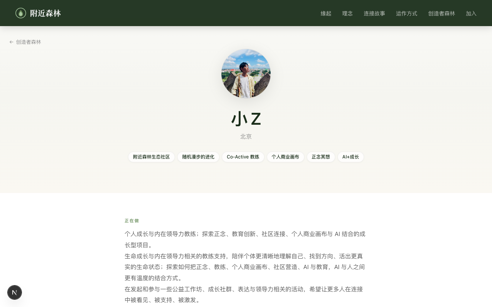
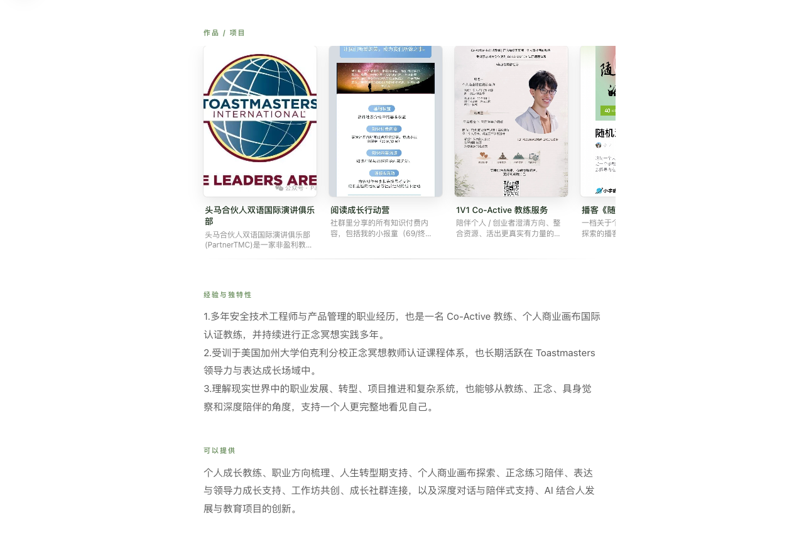
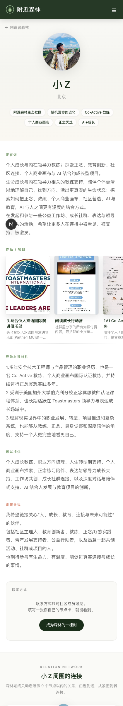
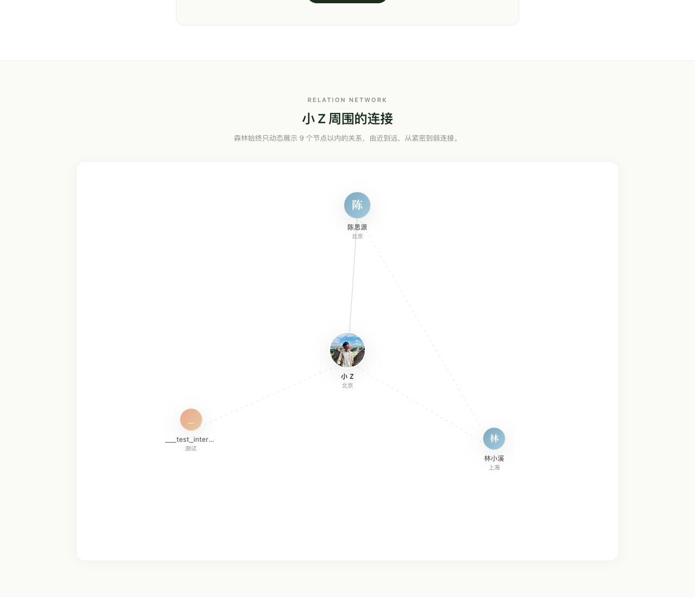
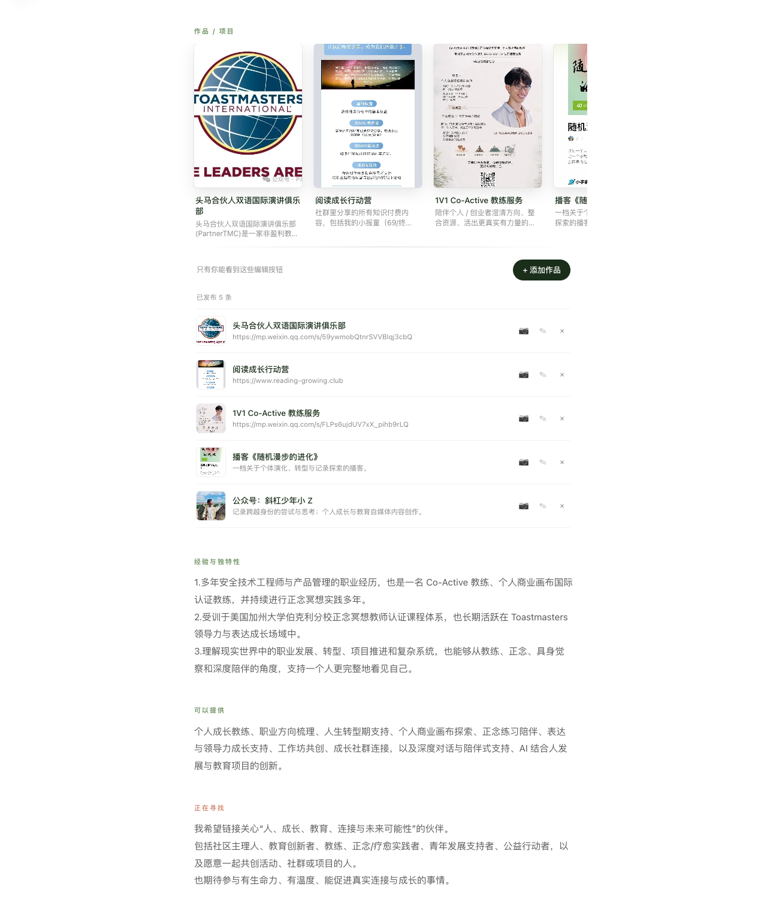

> *让独立的个体彼此连接，流动，让附近生长，让更多创造者的能量流到每一个需要的地方。*

---

## 为什么我们做附近森林

在过去几年里，我们见过太多"独立的人"——
他们做着真诚的事，却常常被淹没在算法和冷清的朋友圈里；
他们渴望连接，却找不到一个能"被完整地看见"的地方。

**附近森林**是一个朝向真实连接的生态社区。
不是名片墙，不是社群目录，不是又一个"加入星球"的入口。

它更像是——
**一片可见的森林。每一个独立的人，都是其中的一棵树。**

---

## 一棵树是怎样生长出来的

成为森林里的一棵树，从填一张**节点卡**开始。
这不是简历，不是"用户注册表"，而是你愿意被看见的那一面。

节点卡有 9 个温柔的提问：

| 字段 | 它在森林里扮演什么角色 |
|---|---|
| 你是谁 / 你在哪里 | 让你成为可被定位的"森林坐标" |
| 形象照 | 一棵树的脸，让节点不只是一行字 |
| 你现在在做什么 | 你最重要的那件事 |
| 你关心什么议题 | 决定你和谁会被自然地分到同一片林荫下 |
| 兴趣爱好 | 工作之外让你心动的事 |
| 经验、优势与独特性 | 你能给森林带来的东西 |
| 你可以提供什么支持 | 你愿意伸出去的手 |
| 你正在寻找什么样的连接 | 你伸出去手的那一头希望接到什么 |
| 微信 / 邮箱 | 让连接真的能落到屏幕之外 |

**这一次新增**：节点卡里多了一个温柔的位置——

### 你的作品 / 项目集（可选）

公众号、播客、产品、服务、长文、小工具——
都可以以一张"书架卡"的形式被森林记住。

每一条作品包含**标题、描述（可选）、跳转链接（可选）**，
最多可以放 12 条；提交后立刻就会以"书架"形式呈现在你的个人页。
**封面图可以等你加入之后，再到自己的个人页慢慢挑、慢慢换。**

---

## 一片森林是怎样组成的

每一张提交的节点卡，会变成森林里的一棵**会生长的树卡**：

每棵树周围漂浮着 ta 的关键词和议题；
当你也填了节点卡，AI 会自动从所有人里挑出**和你最同频 / 最互补**的几位，
附上一句**为什么你们值得相遇**——再加上一段**你们可以一起共创的方向**。

> 林小溪每月办城市对话，缺技术搭档；你缺真实场景，可一起把 AI 写进线下工作坊。

不是冰冷的"你可能感兴趣"，而是有温度的"你们可以做这件事"。

---

## 一棵树的细节

点开任何一棵树，进到 ta 的个人页：

简洁、留白、苹果风。一张大头像、一个名字、ta 关心的关键词，
然后是 ta 在森林里愿意被看见的全部——「正在做」「经验」「可以提供」「正在寻找」「兴趣爱好」。

### 作品 / 项目 · 书架式横向滚动

这是这一版本最大的更新。
不再是一段塞满了链接的长文字，而是：

每一条作品像一本书或一张唱片封面，3:4 的比例、
温柔的渐变兜底封面、点击直接跳转。
左右一拨就能浏览，不用展开任何弹窗。

**移动端也一样温柔：**

### 关系网 · 你周围的连接

继续往下滑，会看到一张关系网：

森林始终只动态展示 9 个节点以内的关系，
**由近到远，从紧密到弱连接**。
连接是有层次的——亲密的人靠得近，刚认识的人在外圈，关系自然会随时间生长。

---

## 编辑你的树

如果这棵树是你的，你随时可以走回来照料它。

每一条已发布的作品都有一行操作：

| 图标 | 功能 |
|---|---|
| 📷 | 一键替换封面图（5MB 内 / JPG / PNG / WebP / HEIC） |
| ✎ | 编辑标题、描述、跳转链接 |
| × | 删除这条作品 |

或者点 **+ 添加作品** 加一本新书到书架。
本人和管理员可以编辑——其他人只看见公开的"书架"，**编辑按钮永远不会出现**。

---

## 不止是名片，是连接的起点

让我们用 5 步说清楚加入流程：

1. **填一张节点卡** — 9 个问题 + 可选的作品集，3 分钟
2. **AI 帮你做匹配** — 同频 / 互补的伙伴 + 共创方向
3. **进入主社群** — 主理人会把你接住
4. **被推送到同频的人** — 「本周森林里有一个特别像你的人加入了」
5. **真实相遇** — 小桌子对话、城市节点见面、共创工作坊

线上只负责"被看见"和"被连接"，
**信任和共创，永远发生在面对面的时刻。**

---

## 来种一棵属于你的树吧

森林不是由一个人长出来的——
它需要**最初的一批种子**，
也需要每一棵新的树来让风、光、水有更多流向。

如果你也是一个独立的、正在创造的人——
一个公众号写作者、一个播客主、一个独立开发者、一个教练、一个空间主理人、一个还在探索方向的转型者——

**这片森林，正等着你种下属于自己的一棵树。**

→ 现在就去 [nearby-forest.club](https://nearby-forest.club/#join)

---

附近森林 · Nearby Forest*
*让独立的个体彼此连接、流动、共创*
