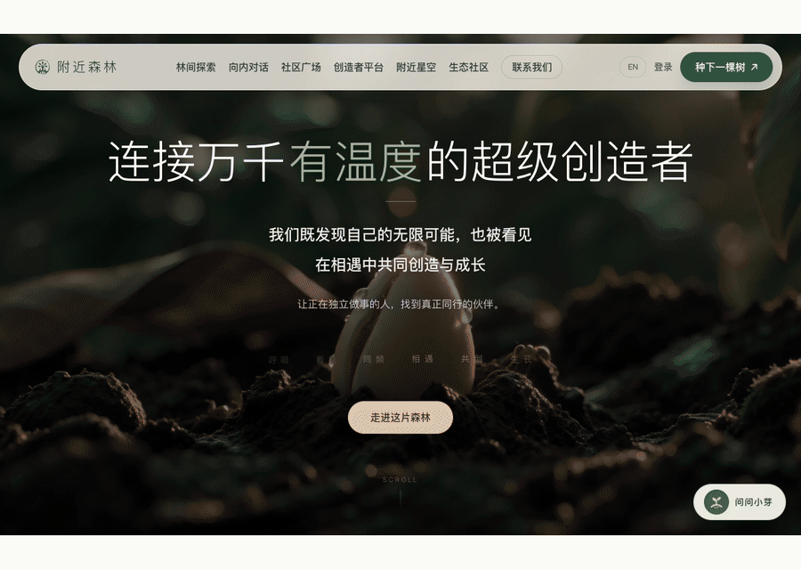

> *让独立的个体彼此连接，流动，让附近生长，让更多创造者的能量流到每一个需要的地方。*

---

## 这一版，一句话

五月的第一版，附近森林让每一个独立的人有了一张**节点卡**、一棵**会生长的树**。

这一版，那棵树长出了自己的房子：**每一位创造者，都有了一个属于自己的网站**。
同时，森林里的路重新走了一遍——静下来、向内看、看看大家在做什么、走近每一个人、抬头看见彼此。

| 菜单 | 去哪 | 在那里可以 |
|---|---|---|
| 林间探索 | `/meditations` | 引导冥想、21 天睡眠-系列、声音、「看见」影像 |
| 向内对话 | `/phil-coach` | 和 AI 教练陪伴者 phil-coach 说说话，进来就能开口 |
| 社区广场 | `/shares` | 「发起吧」看成员正在发起的活动，「Aha Moment」读大家的作品与灵感 |
| 创造者平台 | `/creators` | 每位创造者一张卡；开放了个人网站的，点进去就是 ta 的网站 |
| 附近星空 | `/sky` | 把同一批人看成一片夜空：谁和你靠近、哪些人正连成星座 |
| 生态社区 | `/about` | 附近森林的来处、社群和联系主理人的方式 |

大多数页面的右下角，还多了一位随时可以问路的 **AI 森林园丁「小芽」**。

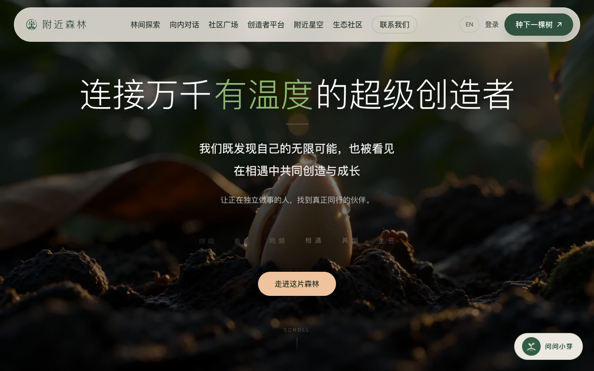

---

## 最大的更新：个人网站空间

一张名片说不完一个人。
所以这一次，森林给每一棵树都盖了一间小房子——**一个真正属于你的网站**。

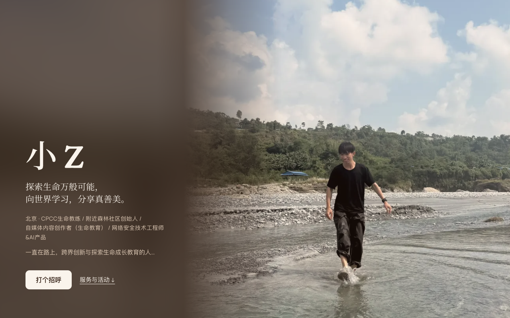

### AI 先起一版，你确认了才对外

你不用从一张白纸开始写。AI 会根据你在节点卡里写下的话，先替你起好一版：
**一句话介绍、身份标签、我在意的、服务单、作品分组**。
（节点卡写得太少时，它会先等你多写几句——没什么可依据的时候，它不替你编。）

网站分成三章——**我这个人**、**走过的路**、**一起做点什么**。
每一处 AI 写的地方都标着「AI」，你可以逐块**确认、改写，或者干脆不要**。

**在你确认、按下「发布」之前，这个网站只有你自己和管理员看得到。**
发布，就是你说「对，这是我」。之后随时可以改，也随时可以取消发布。

### 调成你的样子

不会设计也没关系。网站有六套气质不同的主题——林间米白、晨光花园、墨与留白、晨雾湖面、陶土手作、清晰线条——AI 会按你的资料推荐一套。

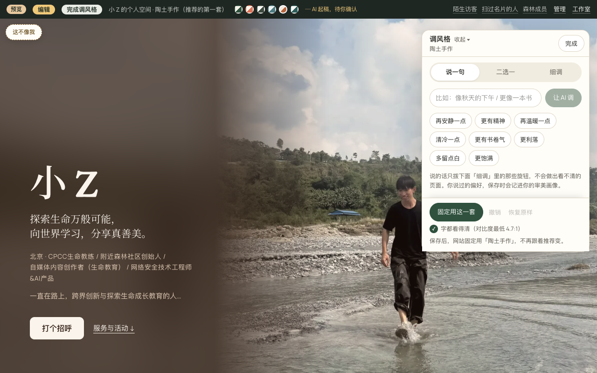

觉得不像你，就在页面上直接调：

- **说一句**：「像秋天的下午」「更有书卷气」「再安静一点」，AI 帮你拨好颜色、字体和留白；
- **二选一**：两版摆在一起，选更像你的那一版，几轮下来就越来越准；
- **细调**：颜色、纸色、字体、字重、留白、圆角、照片……想自己动手也可以。

不管怎么调，**字一定看得清**——每一次改动都会自动检查对比度。
哪一块觉得「这不像我」，就点那一块，说说是哪里不像——颜色、字，还是照片——它当场改给你看，也会记住你的偏好。

### 有人来了，可以做点什么

网站不只是给人看的。发布之后，访客可以：

- **打个招呼**：留一句话和联系方式，只有你和管理员看得到；
- **预约你的服务**：服务单上每一项都能「预约这个」，你在收件箱里接受或婉拒；
- **报名你发起的活动**：线上、线下都行，可以限人数，满了自动排队。

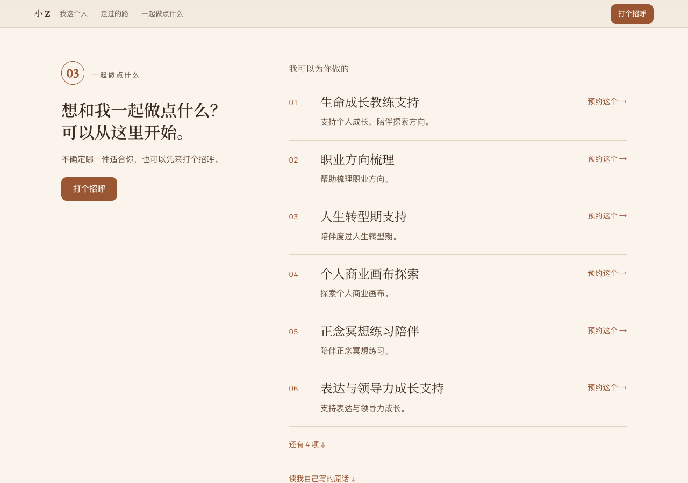

收费活动，平台**不经手钱**：报名的人会拿到一个四位口令，扫你上传的收款码付款、备注里写口令、再传一张付款截图，你对过收款记录再确认名额。

### 谁能看到什么，你说了算

网站的每个板块、你的微信和邮箱，都可以单独设置给谁看：
**所有人 / 森林成员和扫过我名片的人 / 仅森林成员 / 仅自己**。

### 带得出去

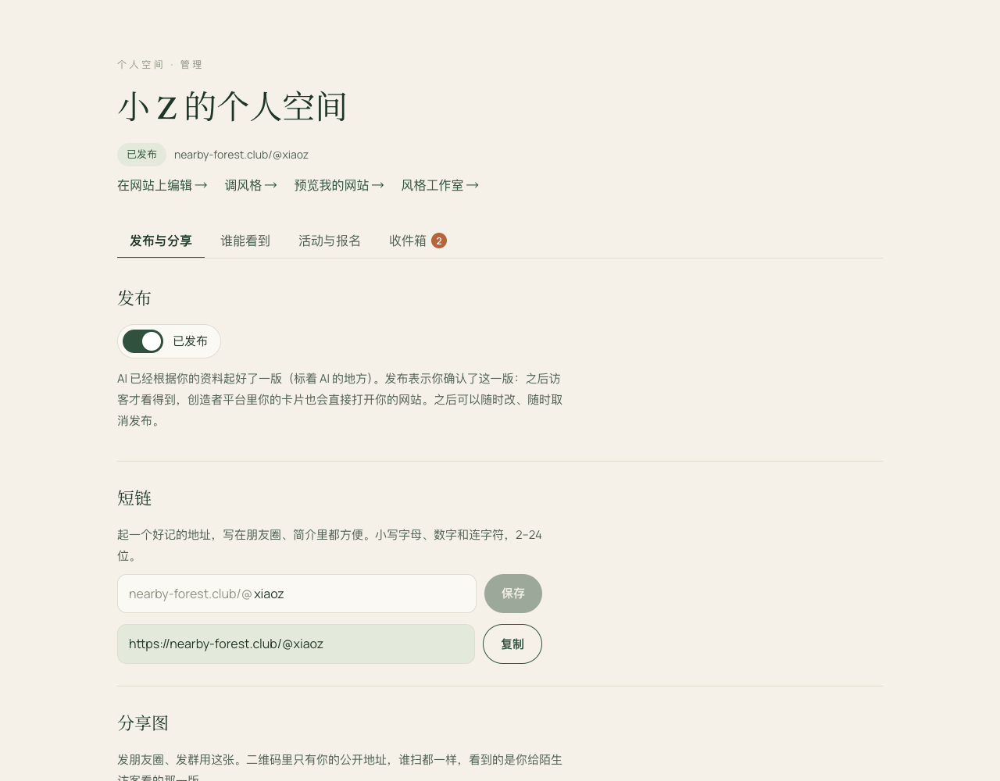

- 起一个好记的**短链**：`nearby-forest.club/@你的名字`；
- 一张**分享图**，发朋友圈、发群用；
- 一张带二维码的**电子名片**：当面递给别人，扫过名片的人能看到你只给「森林成员和扫过我名片的人」看的那部分。

  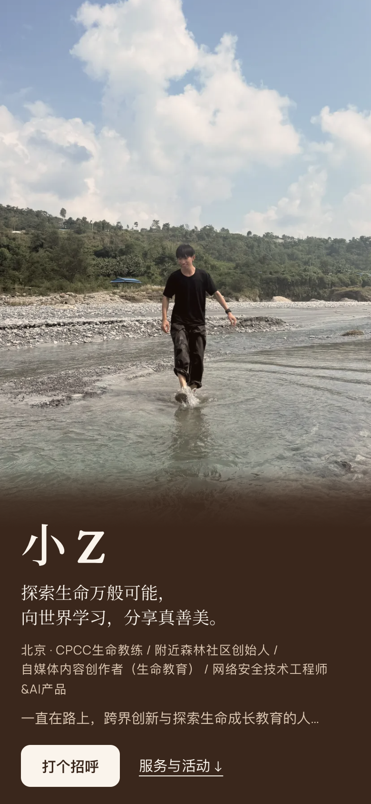
  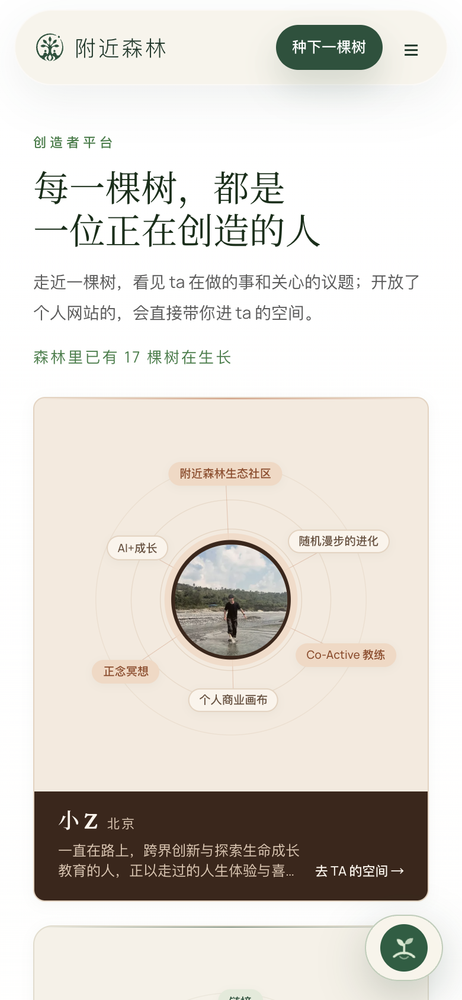

---

## 创造者平台：森林对外的门

原来的「创造者森林」改名叫**创造者平台**。

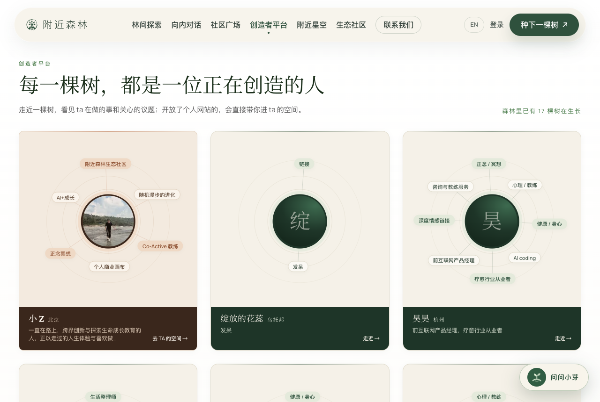

- 一进来就先看到人，而不是一大段介绍；
- **开放了个人网站的人，卡片长成 ta 网站的样子**——颜色、字体、照片，和你点进去看到的是同一套；点卡片，直接走进 ta 的网站；
- 还没发布网站的，卡片照旧带你去 ta 的资料页；
- 森林成员登录之后，页头右边有一个「**我的网站空间**」，随时回到自己的那一间。

---

## 社区广场：看看大家正在发起什么

原来的「个体创造 / 林间分享」，合成了一个**社区广场**，分两个标签。

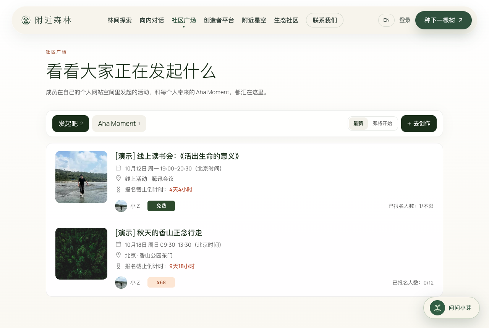

**发起吧**：成员在自己网站里发起、正在报名的活动，都汇到这里。
时间、地点、报名截止倒计时、发起人、免费还是收费、已经报了几位——一眼看清。点进去，就是发起人网站上的那一场活动。

**Aha Moment**：大家的作品、产品、体验和灵感片段。登录之后，右上角「**去创作**」可以投一个 Aha、写一篇文章，或者去自己的网站发起一场活动。投稿会先经过创始人团队审核，再出现在广场上。

---

## 向内对话：进来就能说

PhilCoach 是附近森林里的 AI 教练陪伴者。这一版把它的入口彻底重做了。

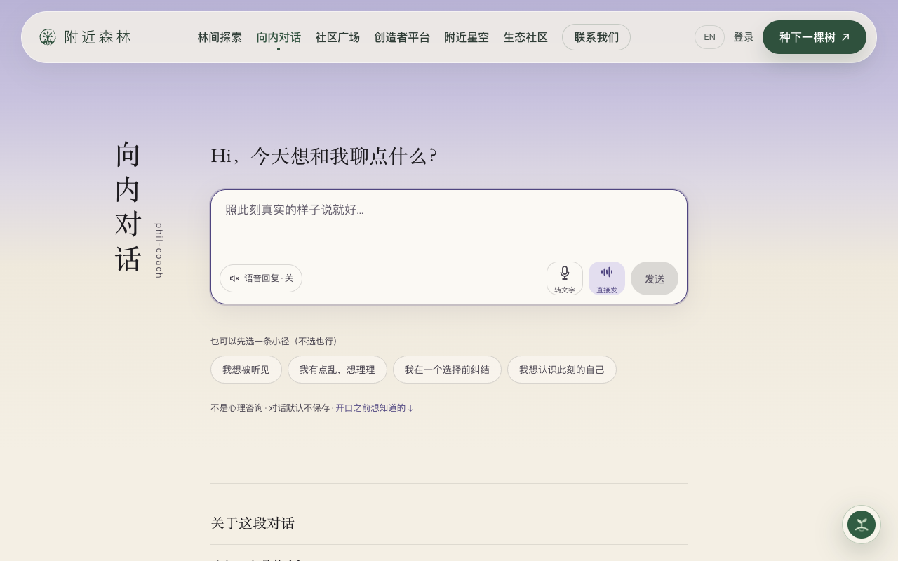

- **进来就是一句问话和一个输入框**，不用往下翻，手机上也一样；
- 想说什么直接说，不用先选；也可以先挑一条小径——**我想被听见 / 我有点乱，想理理 / 我在一个选择前纠结 / 我想认识此刻的自己**；
- 不想打字，可以**说**：「转文字」先变成字、改好再发；「直接发」说完就送出去；
- 打开「语音回复」，它会用温柔的真人嗓音把回应读给你听，女声、男声可以换；
- 颜色换成了一本书的封面：顶上一抹淡紫，慢慢化进米色。

  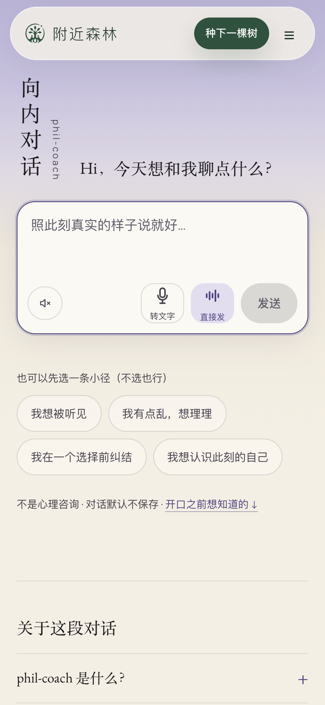

**对话默认不保存**，关掉标签页就散了。
已经是森林成员的，聊到想留住的地方，可以亲手点「**留住这一段**」——明示同意才会存，存进你自己的节点页，只有你看得到、随时可以删。

它不是心理咨询，也不做诊断和治疗。如果你正走在很深的低谷里，请同时找身边可信的人和专业支持。

---

## 林间探索：静下来的地方

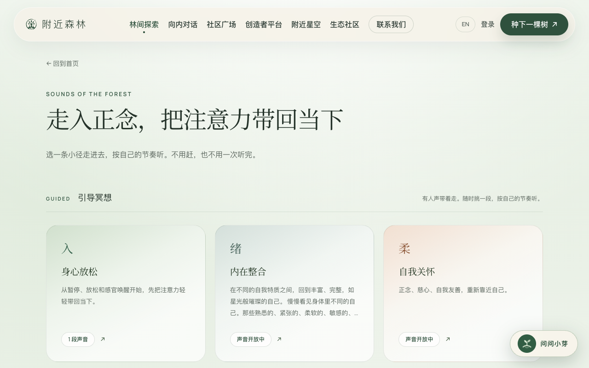

- **引导冥想**：有人声带着走，按主题挑一段，按自己的节奏听；
- **睡眠-系列**：改善睡眠的 21 段正念声音旅程，分三周展开，前三段可以免费试听；
- **声音**：没有语言引导的手碟、颂钵、雨声，适合循环；
- **看见**：附近森林的影像窗口。第一个专题「四时身心」一个节气一支，第一支是**处暑｜慢下来，开始收藏能量**。

登录之后，可以在音频下面写听后感悟，也可以选择匿名。

---

## 附近星空：同一批人的另一种看法

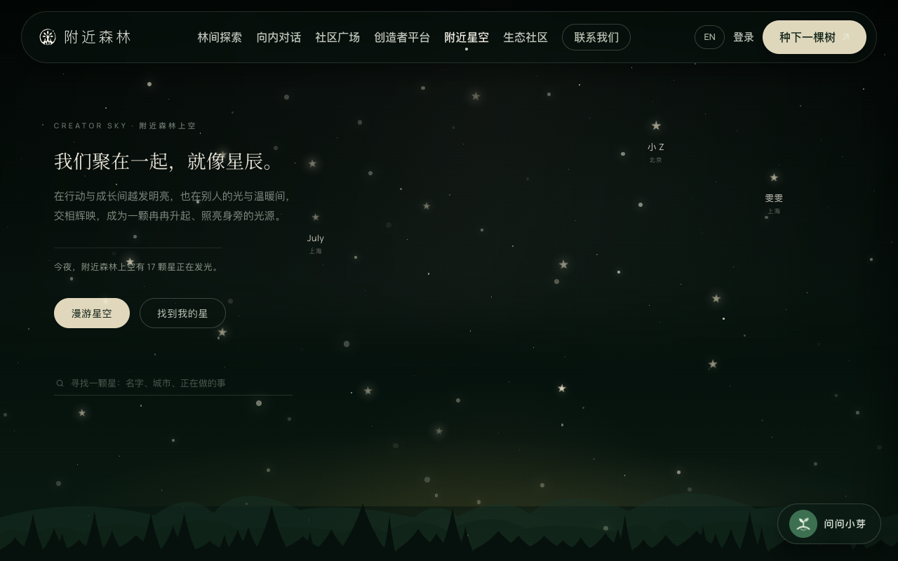

把森林里的每一个人，看成夜空里的一颗星：

- **今夜与你靠近**：为你挑几位可能值得认识的人，并说出**为什么**——你在寻找的，正好是 ta 能提供的；
- **正在形成的星座**：AI 看出哪些人凑在一起可以做成一件事，星座的名字就是那件事；
- **新升起的星**：最近加入森林的人。

星的大小和亮度**不代表任何排名**，只由每个人的 ID 生成。
不想出现在星空里，可以在自己的资料里单独关掉——你仍然在创造者平台里。

---

## 小芽：随时可以问路

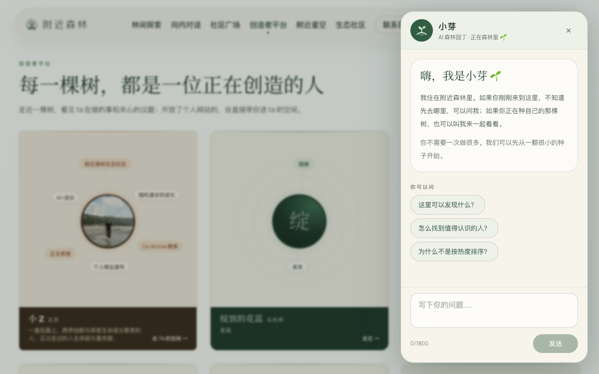

刚来不知道先去哪？想知道某个功能怎么用、自己的资料谁看得到？
点右下角的「**问问小芽**」。它认识这片森林的每一条路，也会诚实地告诉你哪些事现在还做不到。

小芽只回答和引路，**不会替你发布、报名、付款或联系任何人**。

---

## 更顺手的小事

- **邮箱验证码登录**：输入邮箱、填回六位验证码就好，不用再去邮件里点链接；在向内对话里第一次验证邮箱的，可以先**轻登记**留一个称呼，节点卡什么时候补都行；
- **中英双语**：按你所在的地方自动选语言，导航上可以随时切换；
- **手机上**：导航收进一个菜单，每一页在小屏上都重新排过。

---

## 来种一棵属于你的树吧

森林不是由一个人长出来的。
它需要每一棵新的树，也需要每一棵树都有一扇可以被推开的门。

如果你也是一个独立的、正在创造的人——
写作者、播客主、独立开发者、教练、空间主理人、还在探索方向的转型者——

**填一张节点卡，你的网站也会跟着长出来。**

→ 现在就去 [nearby-forest.club](https://nearby-forest.club/#join)

---

*附近森林 · Nearby Forest*

*让独立的个体彼此连接、流动、共创*
